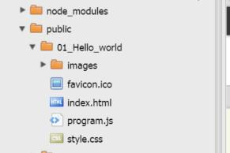

# yr10ist2015

## Installation steps

1. logon to [c9.io](https://c9.io)
2. Press green button `CREATE NEW WORKSPACE`<br />

3. Select `Clone From URL`<br />
  <br />
4. Paste the following url: 
```
  https://github.com/stlukesdy/yr10ist2015.git
```
<br />

  ---Select Workspace Privacy: **Open and Discoverable**<br />
  ---Select **Custom**<br />
  ---Click **Create**<br />

4. Select the new workspace "yr10ist2015".
5. Click **START EDITING**. Wait until loaded.
6. In your bash shell type the following command:<br /><br />
```
npm install
```
7. Again, in your bash shell type the following command:<br /><br />
```
grunt
```

8. Open in chrome `https://yr10ist2015-{your username}.c9.io/`
9. Find the code files in cloud 9 file explorer:<br />

